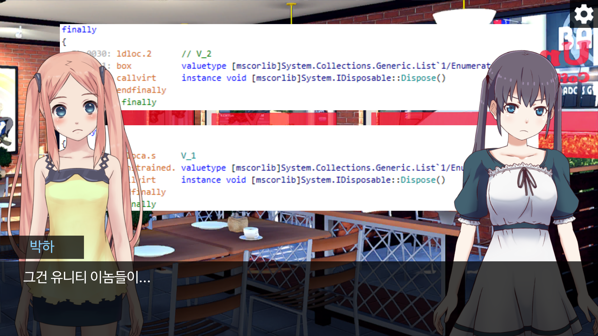
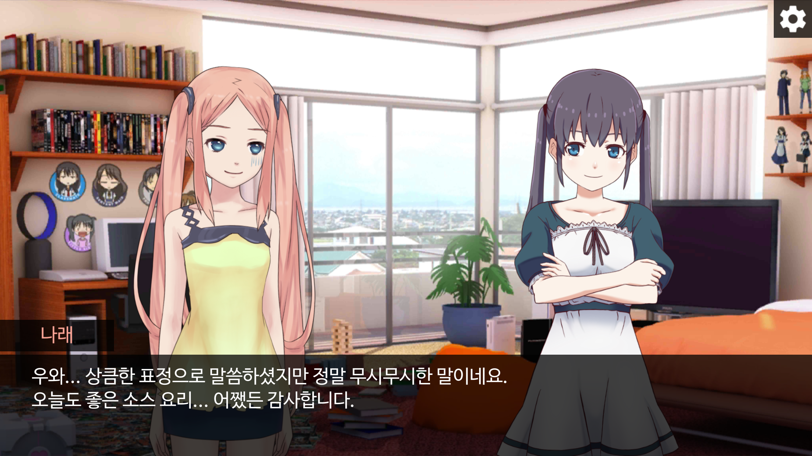
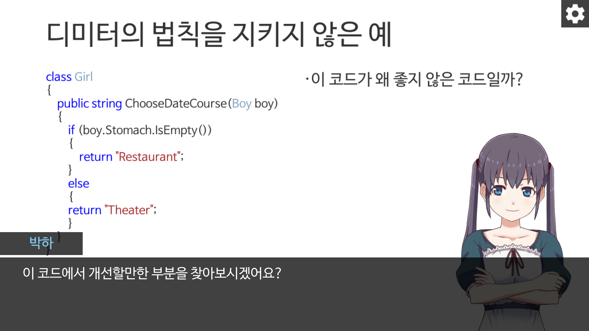
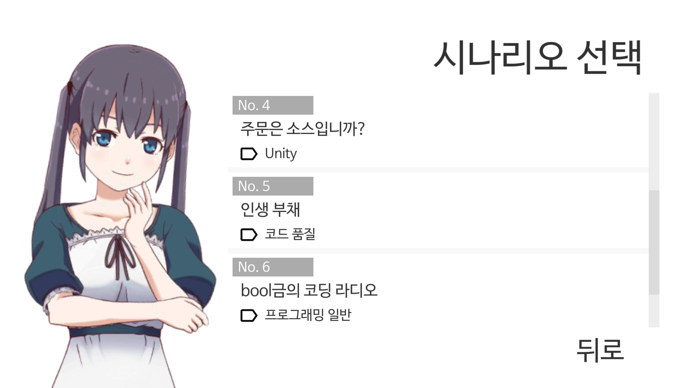

# 가르져춰! 코딩 소녀

코딩 소녀들과 함께하는 프로그래밍 이야기!

코딩 소녀들의 프로그래밍 만담을 비주얼 노벨로 만나보세요.  
Live2D 로 움직이는 귀여운 코딩 소녀와 함께라면 어려운 프로그래밍 이야기도 조금은 쉬워...질까요?

가르쳐줘! 코딩 소녀의 소스코드는 GitHub 에 공개되어 있습니다.  
[https://github.com/lsm1987/CodingGirls](https://github.com/lsm1987/CodingGirls)

## Download

## Screenshot

## Movie

* [유니티에서 foreach를 쓰면 안된다는게 정말인가요? 전편](https://www.youtube.com/watch?v=41syxzusX0w)
* [유니티에서 foreach를 쓰면 안된다는게 정말인가요? 후편](https://www.youtube.com/watch?v=WgEz6DutNkM)

## 참고

* [유니티 버전](CodingGirls/ProjectSettings/ProjectVersion.txt)
